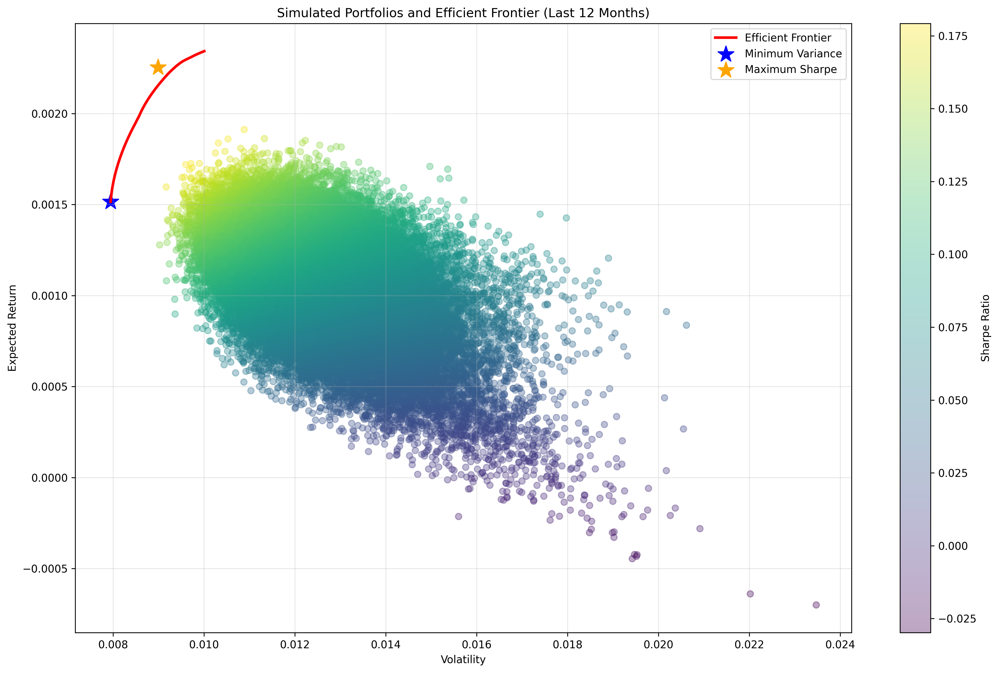
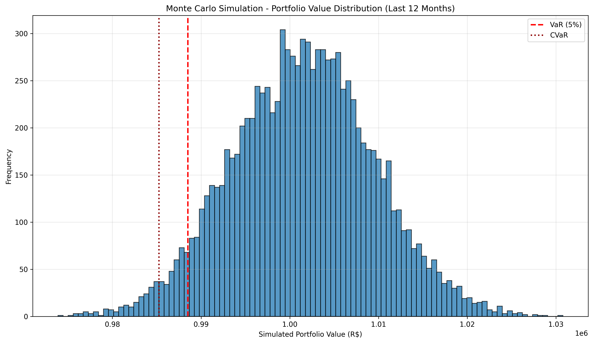

# Portfolio Risk and Return Analysis (Brazilian Equities)

This project performs a quantitative analysis of portfolio risk and return using Brazilian equities, applying Modern Portfolio Theory and risk management techniques.

The analysis is based on real market data from the last 12 months and includes portfolio optimization, Value at Risk (VaR), and Monte Carlo simulation.

---

## Objective

Evaluate the risk-return profile of a diversified portfolio of Brazilian stocks, identifying optimal allocations and measuring risk through different methodologies.

---

## Data

- 20 liquid Brazilian equities (B3)
- Daily adjusted closing prices
- Period: Last 12 months
- Source: Yahoo Finance (yfinance)

---

## Methodology

The analysis includes:

- Calculation of daily returns and covariance matrix
- Simulation of 50,000 random portfolios
- Portfolio optimization using numerical methods (SLSQP):
  - Minimum Variance Portfolio
  - Maximum Sharpe Ratio Portfolio
- Efficient frontier construction
- Risk metrics:
  - Parametric VaR (Normal distribution)
  - Historical VaR
  - Monte Carlo VaR
  - CVaR (Expected Shortfall)
  - Non-diversified VaR (benchmark)

---

## Results (Last 12 Months)

- Parametric VaR (95%): R$ 13,067.93  
- Historical VaR (95%): R$ 10,503.26  
- Monte Carlo VaR (95%): R$ 11,484.23  
- Monte Carlo CVaR (95%): R$ 14,747.89  
- Non-diversified VaR: R$ 24,874.99  

Diversification reduced portfolio risk by approximately R$ 11,807.06, highlighting the importance of asset correlation in portfolio construction.

---

## Visualizations

### Efficient Frontier

### Monte Carlo Simulation

---

## Tools & Technologies

- Python
- NumPy
- Pandas
- Matplotlib
- SciPy (optimization)
- yfinance

---

## Key Insights

- Portfolio diversification significantly reduces risk exposure
- Different VaR methodologies produce consistent but distinct estimates
- Monte Carlo simulation provides a more complete view of tail risk
- Optimal portfolios concentrate in assets with strong risk-return tradeoff

---
